# 🌿 GeoOlive — WebGIS Dashboard for Olive Tree Water Stress Monitoring

> Full-stack WebGIS platform for detecting water stress from drone thermal imagery, predicting yield with AI, and generating irrigation recommendations.

[](https://react.dev/)
[](https://vitejs.dev/)
[](https://fastapi.tiangolo.com/)
[](https://leafletjs.com/)
[](https://www.docker.com/)

---

## 📌 Overview

GeoOlive is a WebGIS dashboard built to monitor water stress in an olive orchard (Aïn Tizgha plot, Benslimane) using drone-based thermal imagery. The system combines remote sensing, machine learning, and agronomic modeling to provide:

- ✅ **Per-tree CWSI mapping** — water stress index (CWSIsi method, Bian 2019) computed for every olive tree
- ✅ **Cross-mission comparison** — temporal tracking of water stress between flight campaigns
- ✅ **FAO-56 water balance** — evapotranspiration and daily water deficit per tree, with a 7-day forecast
- ✅ **ML-based yield prediction** — Ridge model trained on FAO-56 synthetic data
- ✅ **AI-based stress classification** — five supervised classifiers compared (decision tree, neural network, Naive Bayes, SVM, KNN)
- ✅ **AI Agronomist** — conversational assistant (Llama-3.3-70b via Groq API) that can trigger map filters automatically
- ✅ **Advanced modules** — anomaly detection (Isolation Forest), IDW interpolation, hexagonal binning, optimized inspection routing (VRP), plot sectorization

---

## 🏗️ Project Architecture

```
geoolive/
├── backend/                    # FastAPI
│   ├── app/
│   │   ├── cwsi/               # CWSI computation (empirical + CWSIsi methods)
│   │   ├── fao56/               # Water balance, ET0, Kc, Ks
│   │   ├── ml/                  # Stress classification + yield prediction
│   │   ├── missions/             # Multi-mission management
│   │   ├── weather/               # Open-Meteo / ERA5-Land integration
│   │   └── agronome_ia/            # AI agent (Llama-3.3-70b via Groq)
│   └── requirements.txt
│
├── frontend/                   # React + Vite
│   ├── src/
│   │   ├── components/
│   │   │   ├── map/              # Leaflet map, CWSI polygons
│   │   │   ├── overview/          # Key indicators, Recharts charts
│   │   │   ├── predictive/         # Yield prediction
│   │   │   ├── settings/            # CWSI thresholds, calculation method
│   │   │   └── ai-agronomist/         # AI Agronomist interface
│   │   └── services/
│   └── package.json
│
├── docker-compose.yml
└── README.md
```

---

## 🛠️ Tech Stack

### Frontend
- **Framework**: React 18 + Vite
- **Mapping**: Leaflet
- **Charts**: Recharts
- **Styling**: Plus Jakarta Sans, light theme

### Backend
- **Framework**: FastAPI
- **Geospatial processing**: zonal statistics per olive tree polygon
- **Machine Learning**: scikit-learn (Ridge, Random Forest, Gradient Boosting, SVR, KNN for yield; decision tree, neural network, Naive Bayes, SVM, KNN for stress classification)
- **Weather**: Open-Meteo API (ERA5-Land reanalysis)
- **Conversational AI**: Llama-3.3-70b via Groq API

### Deployment
- **Containerization**: Docker (React + Vite + FastAPI)

---

## 📊 Project Data

- **968 olive trees** total (ML dataset, combining both missions)
- **965 trees** mapped in Mission 1 (April 1, 2026)
- **957 trees** mapped in Mission 2 (April 28, 2026)
- **Mean CWSI**: 0.60 (Mission 1) → 0.58 (Mission 2)
- Thermal acquisitions with a DJI Mavic 3T (Mission 1) and a DJI Mavic 3M (Mission 2)

---

## 🖥️ Dashboard Interfaces

The dashboard is organized into six tabs: **Overview**, **Map**, **Report**, **Catalog**, **Predictive**, and **Settings**.

### 1. Overview

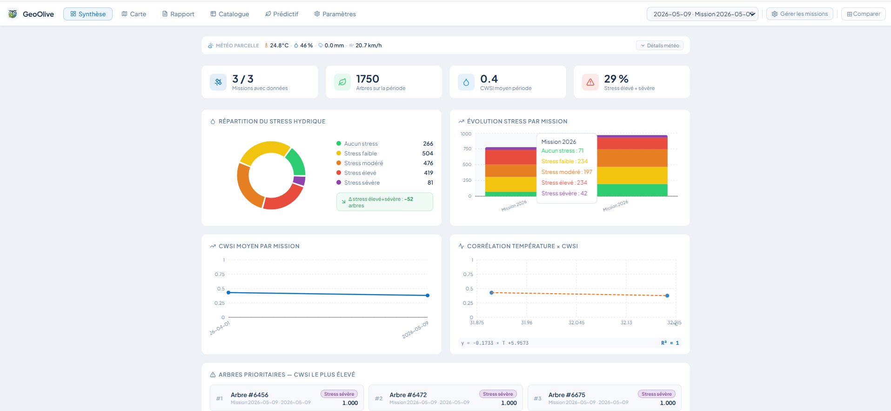
*Key indicators, stress distribution by class, mean CWSI trend across missions, and temperature–CWSI correlation*

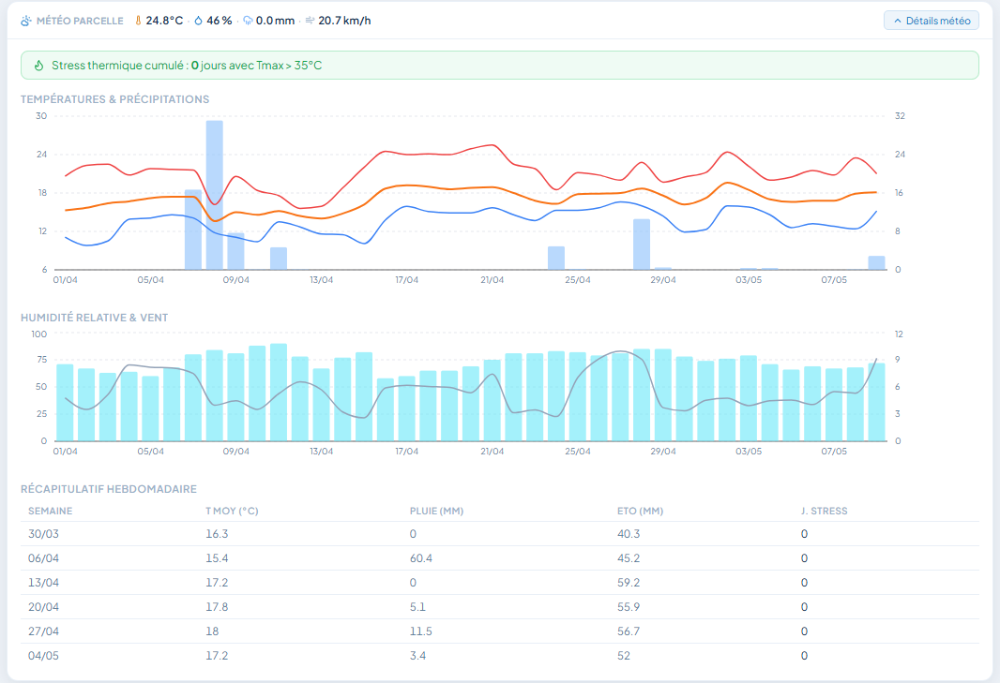
*Temperature, precipitation, relative humidity, and wind speed curves (Open-Meteo API), with estimated weekly ET₀*

---

### 2. Map View

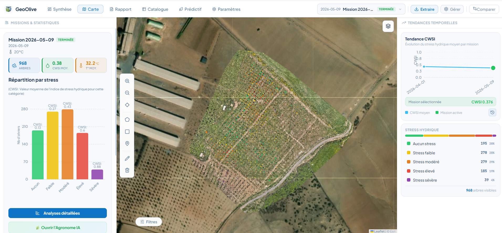
*Olive trees colored by CWSI stress level, statistics panel, and cross-mission trend panel*

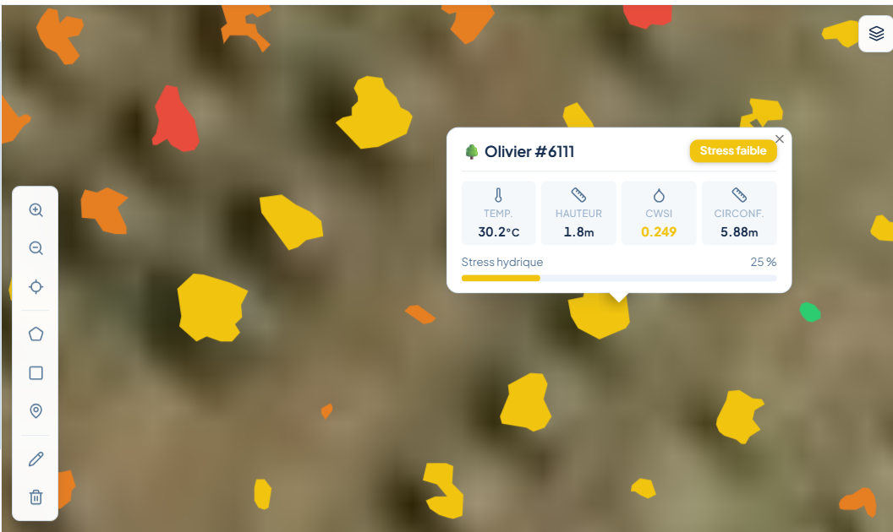
*Leaf temperature, canopy height, CWSI value, and trunk circumference, with a stress-class badge*

---

### 3. Mission Management

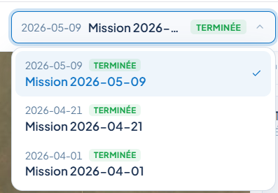
*Navigation between flight campaigns*

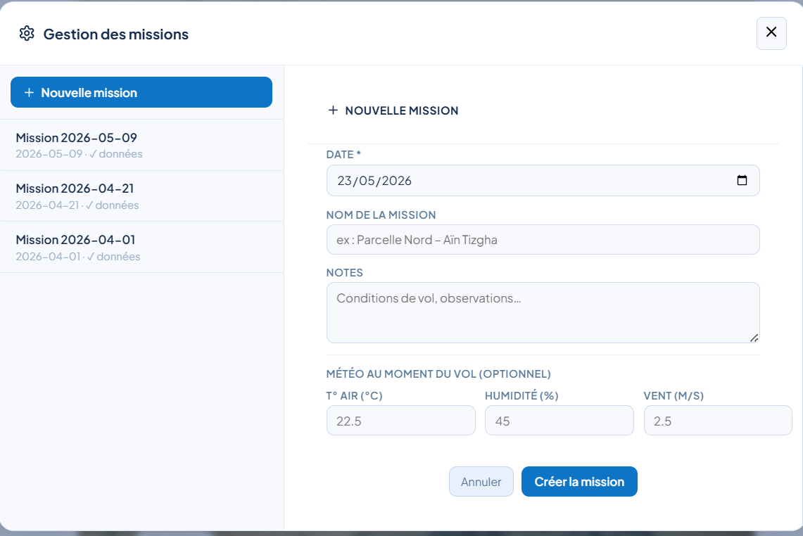
*Mission creation form with shapefile and orthomosaic import*

---

### 4. CWSI Settings

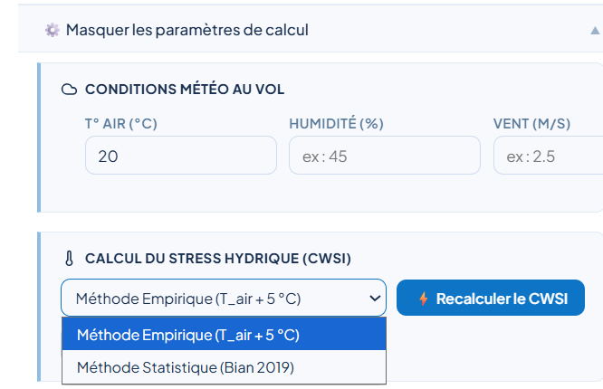
*Choice between the empirical method and the statistical CWSIsi method*

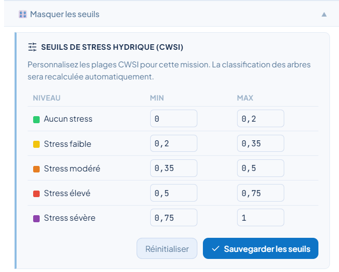
*Five stress-class thresholds, configurable per mission with automatic recalculation*

---

### 5. Detailed Analytics

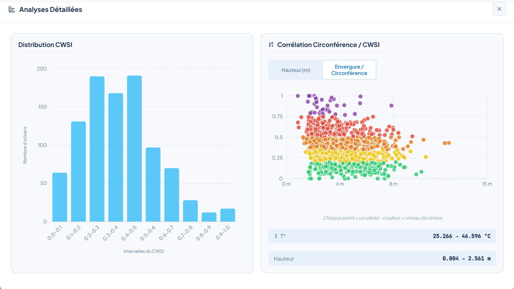
*CWSI value distribution histogram and circumference/CWSI correlation scatter plot by stress class*

---

### 6. FAO-56 Water Balance

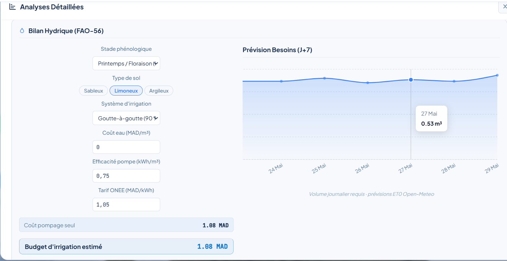
*Agronomic parameters, 7-day water requirement forecast, and estimated irrigation budget in MAD*

---

### 7. Advanced Features

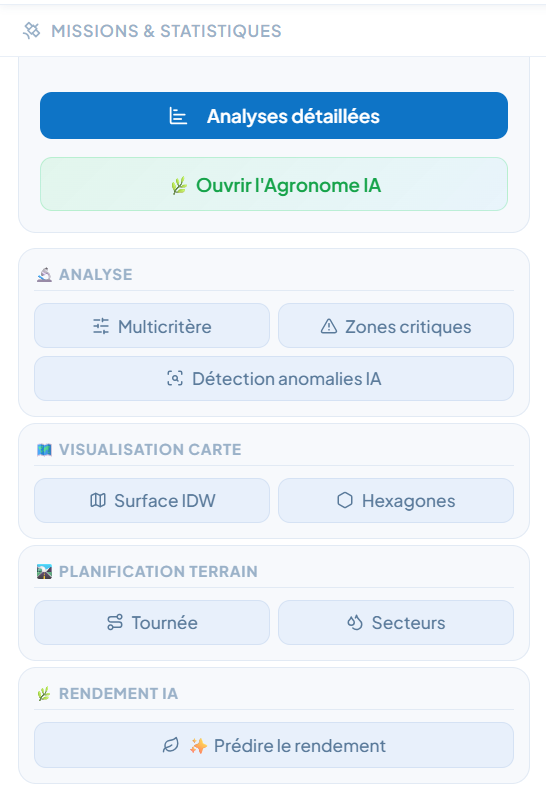
*Multi-criteria filtering, AI anomaly detection, IDW interpolation, hexagonal binning, optimized inspection routing, and plot sectorization*

---

### 8. AI Agronomist

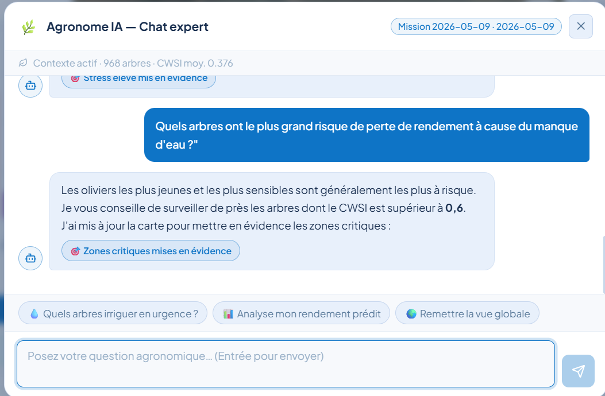
*Conversational assistant (Llama-3.3-70b via Groq API) answering in natural language using the active mission's agronomic data*

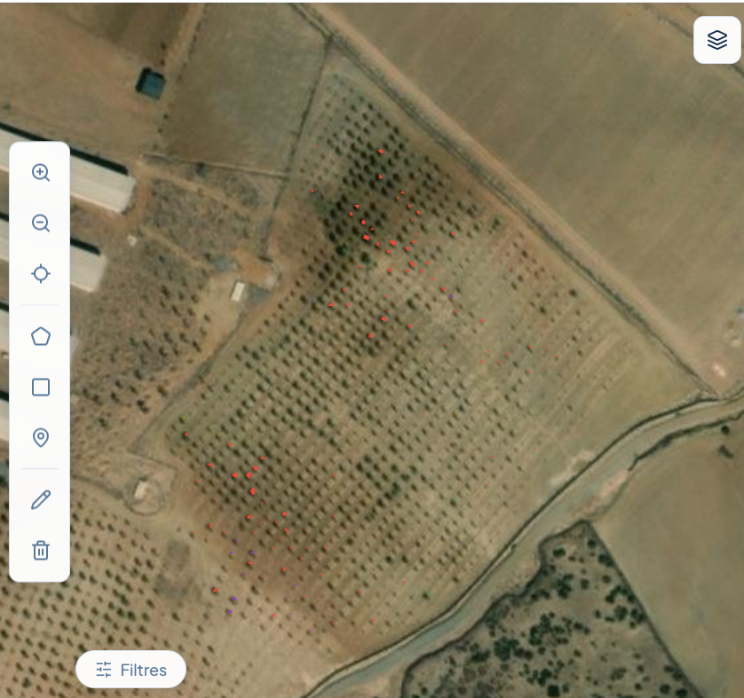
*Automatic spatial filter on trees under high and severe stress, triggered in response to an AI Agronomist query*

---

## 🌡️ CWSI Method

The Crop Water Stress Index is computed using the **CWSIsi** statistical method (Bian et al., 2019), which removes the need for permanent on-site weather instrumentation by estimating the reference temperatures $T_{wet}$ and $T_{dry}$ from percentiles of the canopy temperature (LST) distribution on the thermal orthomosaic.

$$\mathrm{CWSI} = \frac{T_{canopy} - T_{wet}}{T_{dry} - T_{wet}}$$

**Stress classes** (configurable thresholds):

| Class | CWSI range |
|---|---|
| None | ≤ 0.20 |
| Low | 0.21 – 0.40 |
| Moderate | 0.41 – 0.60 |
| High | 0.61 – 0.80 |
| Severe | > 0.80 |

---

## 💧 FAO-56 Water Balance

The module calculates the daily water deficit per tree using the FAO-56 Penman-Monteith method:

- $\mathrm{ET}_0$ (reference evapotranspiration) via Open-Meteo/ERA5-Land
- $K_c$ (crop coefficient) selected according to the olive tree's phenological stage
- $K_s = 1 - \mathrm{CWSI}$ (stress coefficient)
- $\mathrm{ET}_c = \mathrm{ET}_0 \times K_c \times K_s$

---

## 🤖 Machine Learning Modules

### Water stress classification
Five classifiers compared via 5-fold cross-validation, with a cross-mission generalization test to assess real-world robustness against changing acquisition conditions (sensor, resolution, air temperature).

### Yield prediction
Five regression models compared (Random Forest, Gradient Boosting, SVR, KNN, Ridge), trained on a synthetic dataset generated through FAO-56 simulation. The Ridge model achieves the best performance. External field validation is planned for the October–December 2026 harvest.

---

## 🚀 Quick Start

### Prerequisites
- Docker and Docker Compose
- Node.js 20+ (frontend development)
- Python 3.10+ (backend development)

### Installation

```bash
# Clone the repository
git clone https://github.com/your-org/geoolive.git
cd geoolive

# Run with Docker
docker-compose up --build
```

### Access Points
- **Frontend**: http://localhost:5173
- **Backend API**: http://localhost:8000
- **API Docs**: http://localhost:8000/docs

---

## 🔮 Roadmap

- 📏 **Field validation of CWSI** — leaf water potential and stomatal conductance measurements, not yet collected
- 🌾 **External yield validation** — field weighing at the October–December 2026 harvest
- 🧠 **Automated canopy segmentation** — integration of a U-Net pipeline developed in parallel
- 📡 **Soil IoT sensor fusion** — capacitive probes (TDR/FDR) over LoRaWAN/MQTT for near real-time irrigation control
- ☁️ **Cloud deployment** — containerization, PostGIS database, multi-user authentication
- 🔄 **Incremental learning** — progressive classifier retraining with each new mission
- 🌍 **Extension to other crops** — adapting $K_c$/$K_y$ coefficients to other Mediterranean tree species

---

## 🙏 Acknowledgments

- **Drone Globe** for the project framework and field data access
- **FST Tangier** for academic supervision
- **Open-source community** for the frameworks and libraries used

---

*Faculty of Sciences and Technology, Tangier – Geoinformation Engineering Program*
